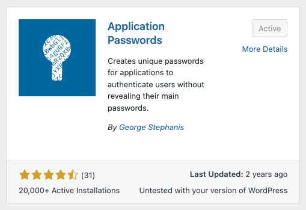

## Setup

### Step 1: Create conda environment and install requirements

```
conda create -n "autoblogger_wordpress"
conda activate autoblogger_wordpress
pip3 install -r requirements.txt
```

### Step 2: Create .env file and input your credentials

Copy the .env.example file into a file called .env in the root of the directory
Fields to change:

1. OPENROUTER_API_KEY: Go to openrouter.ai and create api key. Insert it in the .env file.
2. WP_MEDIA: Change the base url in the WP_MEDIA line in the .env file to your website.
3. Go to add new plugin in wordpress. Search for "application passwords" and install the first app.
   
4. Create a new application in the application passwords app and input WP_APPLICATION_USERNAME and WP_APPLICATION_PASSWORD in the .env file.
5. WP_CATEGORIES: replace base url with your site.
6. WP_TAGS: replace base url with your site
7. UNSPLASH_API_KEY: Make an api key on unsplash.com and replace your api key in the .env file.
8. SERPER_API_KEY: Make an api key on serper.dev and replace your api key in the .env file.
9. OPENAI_API_KEY: Make an api key on openai.com and replace your api key in the .env file.

### Step 3: Create CSV with keywords list

Now you should create a CSV file in csvs/ with a list of your keywords the app will use.
You can easily create a compatible CSV file by exporting a keywords list from ahrefs.com
Otherwise you can create a CSV by copying the probiotics.csv which is already in the directory. The CSV file should contain a column that is labeled Keyword (with capital K). No other columns are needed.

### Step 4: Starting the app

There are two arguments needed to start the app.

1. keyword: this is the name of your CSV file with a list of keywords you would like to create articles for. Since the CSV file given with the repo is called probiotics.csv, to run the keywords in the file you would call "--keyword "probiotics"
2. category: this is the wordpress category that will be used for the articles. If it is not already created in wordpress the category would be created. Example: --category "Health & Household"

Now run the app like this:

```
python3 gpt_keyword.py --keyword "probiotics" --category "Health & Household"
```
